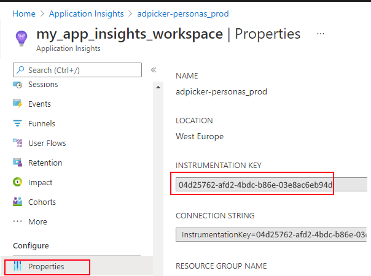

# Azure Logger bundle for the Pyfony Framework

**This package is distributed under the "DataSentics SW packages Terms of Use." See [license](https://raw.githubusercontent.com/pyfony/azure-logger-bundle/master/LICENSE)**

### Installation

```bash
poetry add azure-logger-bundle
```

### Usage

Get the __instrumentation key__



In your project's `src/[ROOT_MODULE]/_config/config.yaml`

```yaml
parameters:
  azureloggerbundle:
    enabled: True
    app_insights:
      instrumentation_key: xxxx-xxxx-xxxx-xxxx
```

or use an environment variable

```yaml
      instrumentation_key: "%env(MY_SECRET_ENV)%"
```
